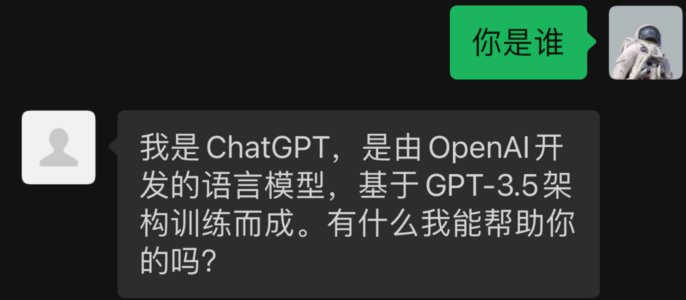
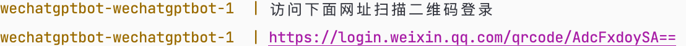

# WechatGPTBot

最近发现了封装 OpenAI 网页版 ChatGPT 接口的项目，可以免费调用ChatGPT接口[chatgpt-api](https://github.com/zhuweiyou/chatgpt-api)。

想到要是接入微信，家人或朋友可以更方便的体验ChatGPT，于是有了这个项目。

## 目前实现功能

+ 私聊回复
+ 群聊@回复




## 快速开始
**1、获取网页版 access_token**

访问 https://chat.openai.com/chat 成功登录之后, 打开浏览器开发者工具 (F12) -> 刷新页面- > Network 找到 /api/auth/session 请求, 得到 accessToken

**2、修改配置文件**
````
# 获取项目
git clone https://github.com/CJ-cooper6/WechatGPTBot.git

# 进入项目目录
cd WechatGPTBot

# 替换config.json中access_token

````
**3、启动项目**

````
依次执行以下命令：
  docker build -t wechatgptbot  .
  docker-compose up -d
  docker-compose logs --tail=10 wechatgptbot
````

**4、访问控制台打印的网址扫码登录**

